---
title       : Identifying human migration patterns using
author      : Anastassiya Zidkova, PhD
framework   : impressjs       # {io2012, html5slides, shower, dzslides, ...}
highlighter : highlight.js  # {highlight.js, prettify, highlight}
hitheme     : tomorrow      # 
widgets     : []            # {mathjax, quiz, bootstrap}
mode        : standalone # {standalone, draft}
knit        : slidify::knit2slides
--- #title x:0 y:0 

<style type="text/css">
  .centeredImage
    {
    text-align:center;
    margin-top:0px;
    margin-bottom:0px;
    padding:0px;
    }
</style>

<p style="font-size:40px" class="centeredImage"><b> Identifying Human Migration Patterns Using DNA </b> </p>
<p style="font-size:38px" class="centeredImage">Visualizing results of admixture analysis in R </br>
Anasstassiya Zidkova, PhD </p>


--- #slide1 x:500 y:-800 scale:0.5
<p style="font-size:26px" class="centeredImage">This  presentation is about finding our roots...</p>
<p class="centeredImage">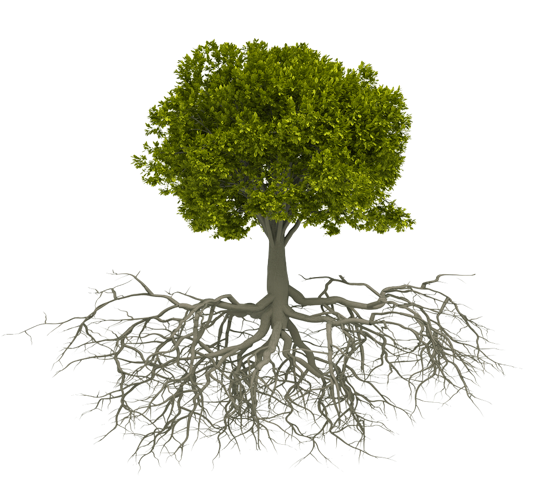</p>


--- #slide2 x:-100 y:-1000 rot:-90
<p style="font-size:30px" class="centeredImage">Where do we come from?</p>


--- #slide3 x:-1000 y:-600 rotx:60 roty:-60 rotz:90
<p style="font-size:30px" class="centeredImage">Modern migration</p>
<p class="centeredImage">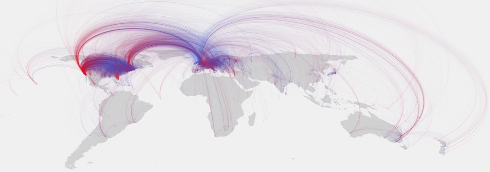</p>
<p style="font-size:20px">Schich et al., 2014</p>


--- #slide4 x:-1000 y:400 scale:0.25
<p style="font-size:30px" class="centeredImage">What about migration that happend before human could write?</p>


--- #slide5 x:-1200 y:1000 rot:-45 scale:0.5
<p style="font-size:30px">We can trace human migration using:</p>
</br>

<ul>
  <li><p style="font-size:24px">Language they speak </p></li>
  <li><p style="font-size:24px">Things they make </p></li>
  <li><p style="font-size:24px">DNA they have </p></li>
</ul>

</p>

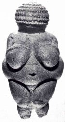
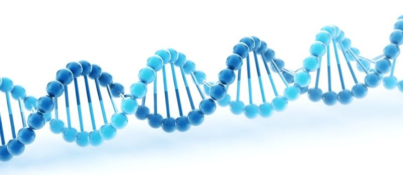


--- #slide6 x:200 y:1000 rot:90 scale:1
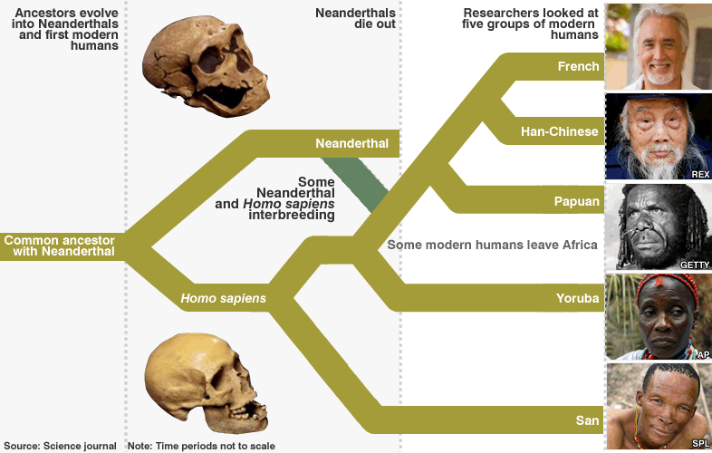


--- #slide7 x:1400 y:1000 z:500 scale:0.5
<p style="font-size:30px" class="centeredImage">We are almost the same...</p>
</br>
<p class="centeredImage">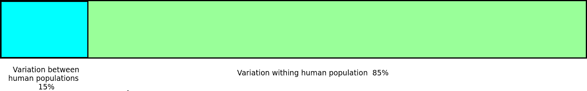</p>


--- #slide8 x:1400 y:0 z:500 scale:0.5
<p style="font-size:20px"><a href="http://www.techtimes.com/articles/3457/20140214/dna-used-to-create-genetic-atlas-of-human-history.htm">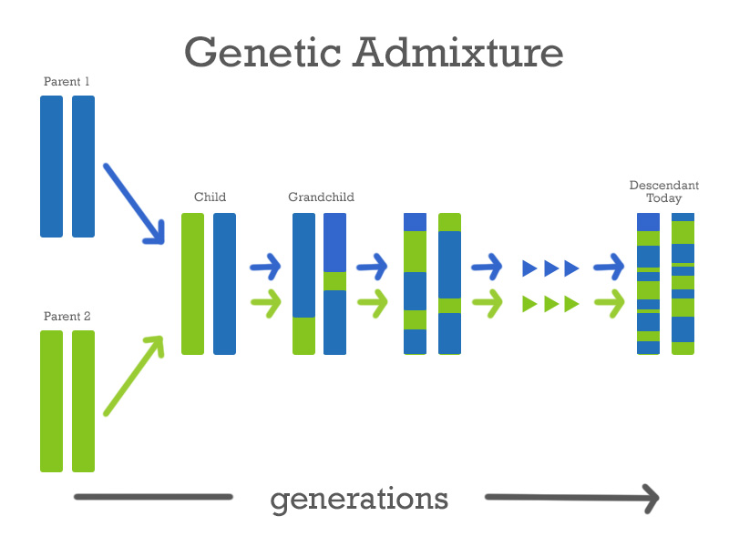</a></p>


--- #slide9 x:2500 y:-800  scale:2
<p style="font-size:30px" class="centeredImage">However, things are a little bit more complicated ...</p>
<p class="centeredImage">
<a href="http://mindfuller.tumblr.com/post/50747828521/evolution-in-7-steps-step-4-natural-selection">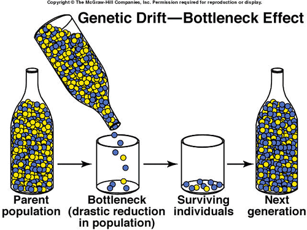</a>
<a href="http://www.ontrack-media.net/gateway/biology/g_bm3l3rs2.html">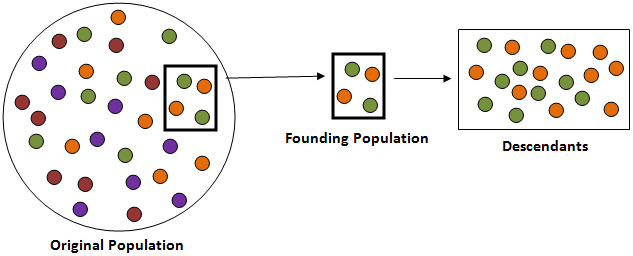</a>
<a href="http://www.biology.arizona.edu/evolution/working/act/mutation/population.html">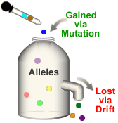</a>
</p>


--- #slide10 x:800 y:-1500  rot:45 scale:0.25
<p class="centeredImage" style="font-size:30px">
We can compare different populations and model migration patterns </br>
<a href="https://en.wikipedia.org/wiki/1000_Genomes_Project">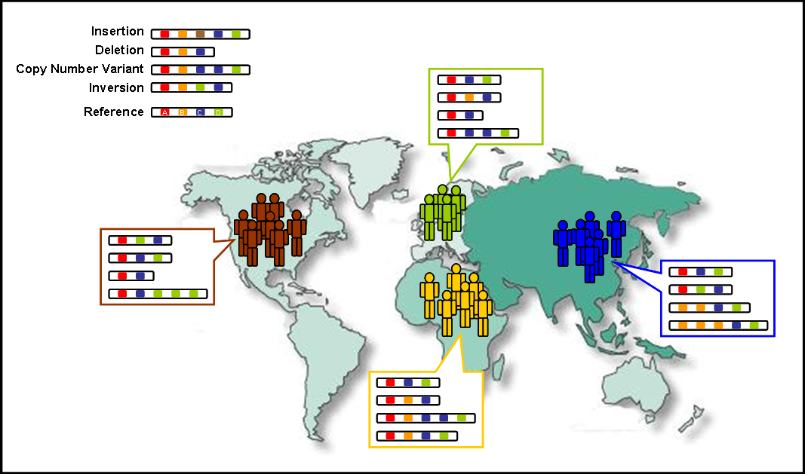</a>


--- #slide11 x:-200 y:-1800 z:500 scale:0.5
<p class="centeredImage" style="font-size:30px">
Migration to America: three wave hypothesis
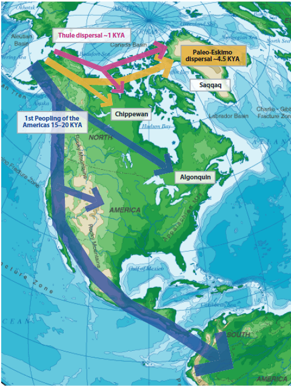
</br>Jobling et al., 2012</p>


--- #slide12 x:-1200 y:-1800 scale:1 rot:-90
<p class="centeredImage" style="font-size:30px">
Dene-Yeniseian hypothesis 
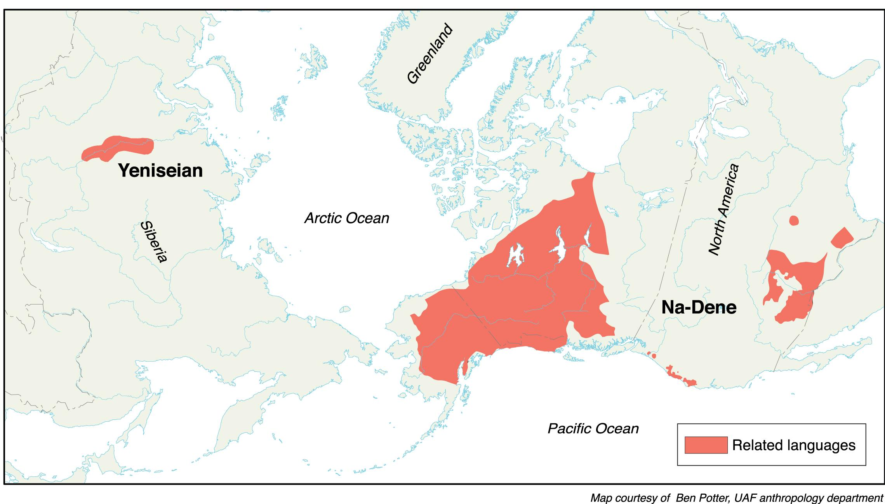</p>


--- #slide13 x:-2000 y:-1200 scale:0.5 rotz:-90
<p class="centeredImage" style="font-size:30px">
<b>Admixture analysis</b></p>
</br>
<ul style="list-style-type:circle">
  <li><p style="font-size:30px">Model-based approach using number of ancestry populations determined by user</p></li>
 <li><p style="font-size:30px">Can correct ancestry of self-identified population samples</p></li>
 <li><p style="font-size:30px">Assumptions</p>
 <ul>
    <li><p style="font-size:28px">Linkage equilibrium between markers</p></li>
    <li><p style="font-size:28px">Unrelated individuals</p></li>
  </ul>
  </li>
</ul>


--- #slide14 x:-2500 y:200 z:500 scale:1
<p class="centeredImage" style="font-size:30px">
<b>Admixture parameters</b></p>
</br>
[ADMIXTURE software](https://www.genetics.ucla.edu/software/admixture/)
<ul style="list-style-type:circle">
 <li><p style="font-size:25px">Unsupervised admixture </p></li>
 <li><p style="font-size:25px">Number of modelled ancestral population: 2-20</p></li>
 <li><p style="font-size:25px">Sample: 1564 individuals from 86 populations</p></li>
 <li><p style="font-size:25px">Number of variable genetic markers: 33,039</p></li>
</ul>


--- .slide #slide15 x:-2500 y:1000 z:-500 scale:0.25 rot:30
<font size=3px>
File with sample information
```{r, echo=FALSE}
pheno <- read.table('dataset5.order', head=F)
colnames(pheno)<-c('Row number', 'ID1', 'ID2', 'Population', 'Position')
head(pheno)
```
Example file of admixture analysis K-3
```{r, echo=FALSE}
q <- read.table('dataset5.3_3.Q', head=F)
colnames(q)<-c('K1', 'K2', 'K3')
head(q)
```
</font>


--- .slide #slide16 x:-2500 y:2500 z:1000 scale:0.1 rot:-180
<font size=3px>
```{r, eval=FALSE}
intervals <- c(18, 54, 83, 105, 121, 136, 152, 171, 185, 196, 221,
               241, 254, 273, 309, 345, 363, 378, 393, 414, 429, 434,
               447, 466, 479, 500, 524, 534, 552, 577, 593, 611, 627,
               641, 660, 675, 688, 705, 728, 748, 785, 827, 839, 845)
intervals2 <-  c(36, 71, 95, 114, 128, 144, 159, 183, 187, 205, 236, 
                 245, 263, 283, 335, 355, 370, 385, 400,428, 430, 
                 437, 457, 474, 484, 515, 532, 536, 568, 585, 600, 
                 621, 632, 650, 669, 680, 695, 714, 742, 754, 816, 
                 837, 840, 850) 
pop_ord <- c('Iranian', 'Armenian', 'Abkhazian', 'Balkar', 'Kumyk', 
             'Nogay', 'North_Ossetia', 'Chechen','Ingush', 'Lezgin', 
             'Romanian', 'Belorusian', 'Russian', 'Ukrainian', 'Finnish', 
             'Hungarian', 'Mari', 'Mordvinian', 'Tatar', 'Ket_present', 
             'Ket', 'Selkup', 'Shor', 'Khakas', 'Teleut','Altaian', 'Chuvash',
             'Dolgan', 'Even', 'Yakut', 'Buryat', 'Evenk', 'Chukchi', 'Kazakh', 
             'Kyrgyz','Mongol', 'Turkmen', 'Uzbek', 'Tajik', 'Gujarati', 
             'Indian','Athabaskan', 'Chipewyan',  'Saqqaq')
c2 <- c("#000000","#FFFF00")
q_pheno_s_sub <- subset(q_pheno_s, q_pheno_s$col4 %in% pop_ord)
barplot(t(as.matrix(q_pheno_s_sub[, 6:7])), space=0, width = c(rep.int(1,840), 10), 
        col=c2, xlab=NULL, ylab=NULL, xaxt = "n", main =NULL,  border=NA, 
        args.legend= list(bty="n", border=F), las=2, yaxt = "n")
axis(1, at = as.vector(intervals), labels = pop_ord, cex.axis=0.65, las=2)
abline(v=intervals2)
```
</font>

--- #slide17 x:-1500 y:2500 z:500 rot:180
<p class="centeredImage" style="font-size:30px">
Admixture plot </br>
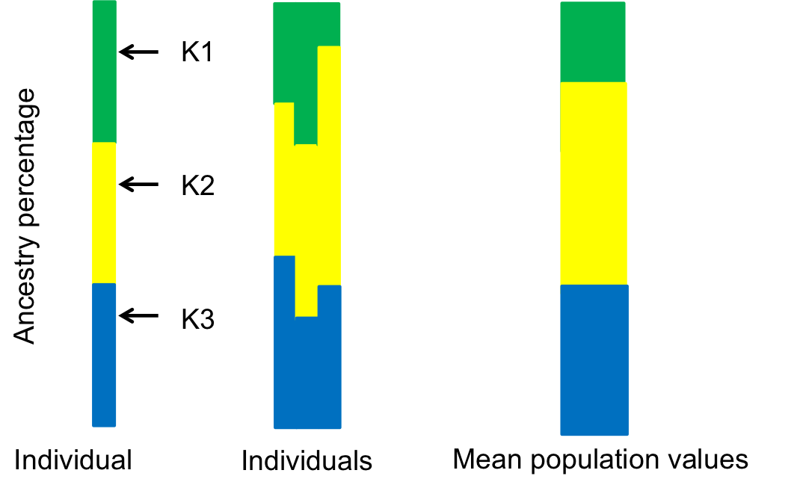</p>

--- #slide18 x:0 y:3500 scale:0.25
<p class="centeredImage" style="font-size:30px">
Admixture plot K-14 </br>
</br>
</p> 

--- #slide19 x:1500 y:2500 rotz:90
<p class="centeredImage">
</p> 

--- #slide20 x:2500 y:1500 z:1000 scale:0.5 rot:360
<p class="centeredImage"><b>Thank you for your attention!</b></br>
</br>
anastazie.d@gmail.com</p>
